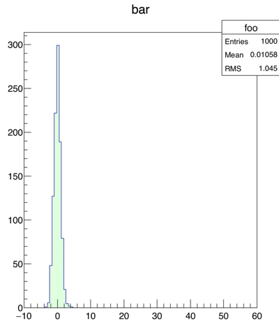

Instant gratification:
======================

    (load stdlib.rut)
    (def {nut} (new TCanvas nut FirstSession 10. 10. 700. (+ 1. 900)))

    (def {a} (new TH1F "foo" "bar" 100 -10. 60.))

    (doto a
      {SetFillColor 3}
      {SetFillStyle 3003}
      {FillRandom gaus 1000}
      {Draw}
    )

What is this?
=============

ROOTure |ˈrʌtʃə| is modest attempt at having a LISP-like language where
[ROOT](https://root.cern.ch) is a first class citizen. This means that
the language itself not only tries to simplify interoperability with
ROOT but considers by design the ROOT object model as a fundation of its
own APIs.

If you are thinking this is similar to what happens with
[Clojure](http://clojure.org) and Java, you get exactly the idea.

The initial implementation comes from the very nice tutorial ["Build
your own LISP"](http://www.buildyourownlisp.com).

This is my Christmas pet project and it's not meant for production but
you can still amuse yourself with it.

Compiling & running
===================

You can compile ROOTure using cmake:

    cmake -DROOT_ROOT=<path-of-root-installation> .
    make

Assuming you have ROOT in your LD_LIBRARY_PATH, you can then execute it
by doing:

    ./rooture

which should present you a prompt. Alternatively you can pass a script
so that it is executed as a first thing.

    ./rooture my-script.rut

Syntax and standard library
===========================

Language syntax itself is close to any other LISP out there, so everything
is expressed in reverse Polish notation, with the a

ROOT Interoperability
=====================

You can create ROOT objects by using the `new` function, e.g.:

    (new TH1F Foo Bar 1000 -1 1)

You can invoke methods of a ROOT object via the `.` function. E.g.:

    (def {h1} (new TH1F Foo Bar 1000 -1 1))
    (. FillRandom h1 gaus 10000)
    (. Draw)

In case you want to invoke multiple methods on the same object, you can use the
`doto` function, similarly to what happens in clojure:

    (doto h1
        {FillRandom gaus 10000}
        {Draw}
    )
