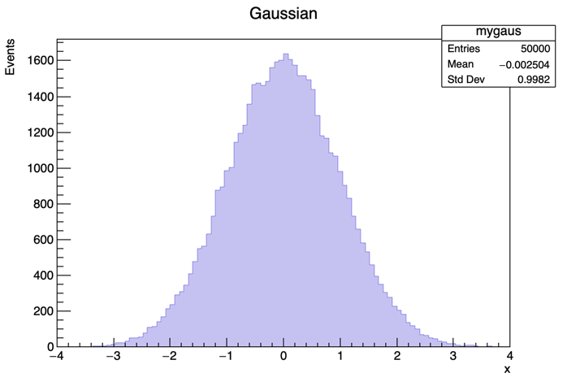
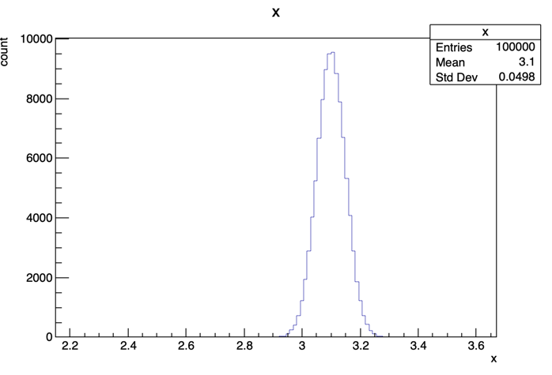
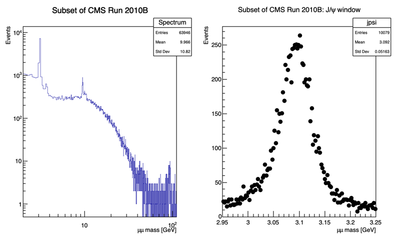

# ROOTure

**ROOTure** |ˈrʌtʃə| is a Lisp dialect where [ROOT](https://root.cern.ch) is a
first-class citizen. Instead of writing C++ macros or Python scripts, you get an
interactive REPL that speaks ROOT natively — create histograms, run RDataFrame
pipelines, fit functions, and render canvases, all in a concise Lisp syntax.

If you know [Clojure](http://clojure.org) and its relationship with Java, you get
the idea immediately.

---

## Quick taste

```scheme
(load stdlib.rut)

(doto (new TH1F "h" "Gaussian;x;Events" 100 -4. 4.)
  {SetFillColorAlpha 9 0.35}
  {SetLineColor 9}
  {FillRandom gaus 50000}
  {Draw})
```



---

## RDataFrame pipelines

The `->` threading macro chains RDataFrame operations cleanly:

```scheme
(-> (new ROOT::RDataFrame 100000)
    {.Define "x" "gRandom->Gaus(3.1, 0.05)"}
    {.Histo1D "x"}
    {.DrawClone})
```



For more complex pipelines, named intermediate results bind naturally.
The example below reproduces the CMS dimuon spectrum from open data — full
spectrum on the left (log scale), J/ψ window on the right:

```scheme
(load stdlib.rut)
(def {filteredEvents}
  (-> (::FromCSV ROOT::RDF "http://root.cern/files/tutorials/df014_CsvDataSource_MuRun2010B.csv")
    {.Filter | Q1 * Q2 == -1}
    {.Define "m" | sqrt(pow(E1 + E2, 2) - (pow(px1 + px2, 2) + pow(py1 + py2, 2) + pow(pz1 + pz2, 2)))}))

(def {fullSpectrum} (.Histo1D filteredEvents
  (new ROOT::RDF::TH1DModel "Spectrum" "Subset of CMS Run 2010B;#mu#mu mass [GeV];Events" 1024 2. 110.) "m"))
(def {jpsi} (.Histo1D
  (-> filteredEvents {.Filter | m < 3.25 && m > 2.95})
  (new ROOT::RDF::TH1DModel "jpsi" "Subset of CMS Run 2010B: J/#psi window;#mu#mu mass [GeV];Events" 128 2.95 3.25) "m"))

(def {dualCanvas} (new TCanvas "DualCanvas" "DualCanvas" 800 512))
(.Divide dualCanvas 2 1)
(doto (.cd dualCanvas 1) {SetLogx} {SetLogy})
(.DrawClone fullSpectrum "Hist")
(.cd dualCanvas 2)
(doto jpsi {SetMarkerStyle 20} {DrawClone | HistP})
```



---

## Key features

- **Interactive REPL** with history and tab completion
- **Seamless ROOT interop** — any ROOT class, method, or global is directly accessible
- **`doto`** — apply multiple methods to one object (à la Clojure)
- **`->`** — thread a value through a chain of method calls
- **`@name`** — retrieve any named ROOT object via `gROOT->FindObject`
- **Lambdas** — pass rooture functions as C++ callables (e.g. `RDataFrame::Define`)
- **`|` tail strings** — write unquoted strings at the end of a Q-expression: `{.Filter | pt > 10}`
- **`annotate`** — attach documentation to symbols; MCP-accessible for AI-assisted analysis
- **MCP server** — connect Claude or any MCP-capable AI assistant for assisted analysis

---

## Building

Requires CMake and a ROOT installation (≥ 6.20):

```sh
cmake -DROOT_ROOT=<path-to-root> -B build
cmake --build build
```

Run interactively:

```sh
./build/rooture
```

Or execute a script:

```sh
./build/rooture examples/df014_CsvDataSource.rut
```

---

## Language overview

### Everything is an expression

```scheme
(def {h} (new TH1F "foo" "bar" 100 -5. 5.))   ; create object
(.FillRandom h gaus 10000)                      ; call method
(.Draw h)                                       ; another method
```

Unquoted symbols auto-convert to strings, so `gaus` and `"gaus"` are identical.

### Method calls

```scheme
(.Method obj arg1 arg2)     ; instance method
(::StaticMethod Class arg)  ; static / namespace-scoped method
```

### `doto` — multiple methods on one object

```scheme
(doto canvas
  {SetGrid}
  {SetLogx}
  {>> {GetXaxis} {SetTitle "mass [GeV]"}}   ; sub-object pipeline
  {Update})
```

The `{>> {Step1} {Step2}}` form threads the object through a mini-pipeline,
useful when you need to call a method on a sub-object (e.g. an axis).

### `|` — tail strings in Q-expressions

A `|` inside a Q-expression starts an inline string that runs to end-of-line
or to the closing `}`, whichever comes first — no quotes needed:

```scheme
{.Filter | pt > 20 && eta < 2.4}          ; same as {.Filter "pt > 20 && eta < 2.4"}
{SetTitle | #tau [ps]}                     ; special characters need no escaping
{.Define "col" | sqrt(x*x + y*y)}         ; earlier args can still be quoted normally
```

Multiple `|` strings can appear on separate lines within one Q-expression:

```scheme
{1 | foo
 0 1 2 | bar}           ; equivalent to {1 "foo" 0 1 2 "bar"}
```

The only character that cannot appear in an inline string is `}`.

### `->` — method chaining

```scheme
(-> dataFrame
  {.Filter | pt > 10}
  {.Define "eta2" | eta*eta}
  {.Histo1D "eta2"}
  {.DrawClone})
```

### `@name` — look up named objects

```scheme
(doto @myCanvas
  {Modified}
  {Update})
```

### Lambdas

```scheme
(def {myFilter}
  (\{x} {> x 0.5}))

(.Filter df myFilter {"x"})
```

### `annotate` — documenting symbols for AI-assisted analysis

Attach a human-readable description to any symbol with `annotate`:

```scheme
(def {fitRange} {2.9 3.2})
(annotate fitRange "J/psi fit window in GeV — widen to include more background")

(def {nBins} 128)
(annotate nBins "Histogram binning — increase for better mass resolution at the cost of stats")
```

Annotations are accessible at any time:

```scheme
(annotations)   ; => {{"fitRange" "J/psi fit window ..."} {"nBins" "Histogram binning ..."}}
```

When running with `--mcp`, the `list_annotations` tool exposes all annotations to the
connected AI assistant. This lets you mark the meaningful knobs in your analysis script
so the assistant knows exactly what to suggest changes to:

```scheme
; The assistant calls list_annotations, sees "nBins", reads its description,
; and can propose (def {nBins} 256) with the right context.
```

---

## MCP server

ROOTure includes a [Model Context Protocol](https://modelcontextprotocol.io) server
so AI assistants (e.g. Claude) can evaluate expressions, inspect results, and capture
canvas images — enabling AI-assisted interactive analysis.

Start with the MCP flag:

```sh
./build/rooture --mcp
```

Available MCP tools:

| Tool | Description |
|------|-------------|
| `eval` | Evaluate any rooture expression |
| `list_symbols` | List all user-defined symbols |
| `list_annotations` | List all `annotate`d symbols with their descriptions |
| `list_canvases` | List open ROOT canvases |
| `get_canvas` | Capture a canvas as a PNG image |
| `get_window` | Capture a GUI window (`TGFrame`) as a PNG image |
| `reload` | Restart the server after rebuilding |

---

## Examples

| File | Description |
|------|-------------|
| `examples/draw_histo.rut` | Basic histogram with fill style |
| `examples/df000_simple.rut` | Minimal RDataFrame pipeline |
| `examples/df014_CsvDataSource.rut` | CMS dimuon spectrum from CSV |
| `examples/df101_h1Analysis.rut` | H1 D* analysis with fitting |
| `examples/assembly.rut` | TGeo geometry assembly |

---

## Background

The interpreter started from the ["Build Your Own Lisp"](http://www.buildyourownlisp.com)
tutorial and evolved into a ROOT-native REPL. It uses ROOT's Cling/LLVM JIT to dispatch
method calls, so you get the full power of C++ ROOT without writing C++.
