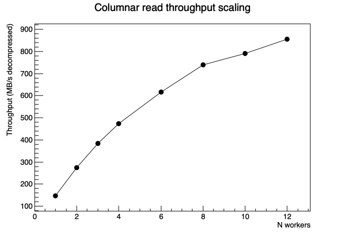
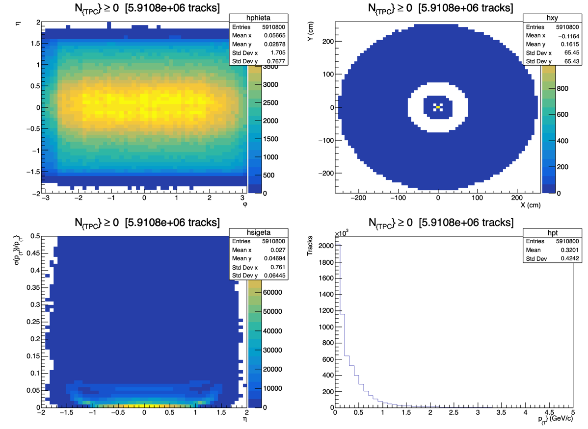
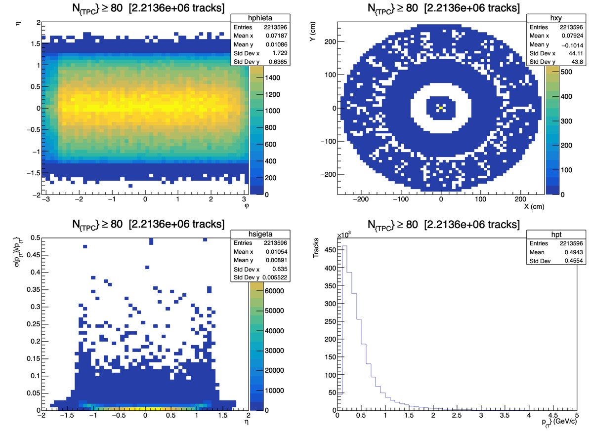

# Columnar branch API and incremental track GUI

This page documents the design and implementation of the columnar branch-reading
API for AO2D data, and the `examples/tracks_col_gui.rut` interactive GUI that
demonstrates it.

---

## Motivation

The existing `examples/tracks_3d_gui.rut` uses `RDataFrame` to read AO2D branches.
RDataFrame is expressive but its API surface in rooture is essentially C++ string
evaluation — `.Define "phi" "fAlpha + TMath::ASin(fSnp)"` — which is opaque to the
rooture reader and incurs interpreter overhead per entry.

The goal was a lower-level API that:
- reads TTree branches directly as flat typed buffers (`float*`, `uint8_t*`, …)
- exposes element-wise operations as JIT-compiled C++ function pointers
- lets `pmap` parallelize across timeframes with no interpreter overhead per element
- serves as the backend for a responsive interactive GUI where slider updates
  re-read and re-filter data in ~200 ms

---

## Columnar API overview

### `load-branch`

```scheme
(load-branch path tree-path branch-name) → Column
```

Opens the AO2D file, locates the branch, reads all entries via `GetBulkEntries`
into a malloc'd flat buffer, and closes the file.  The result is a `LVAL_COLUMN`
wrapping a `RutColumnPtr` (`std::shared_ptr<RutColumn>`):

```cpp
struct RutColumn {
  int    dtype;   // COL_FLOAT32, COL_UINT8, COL_INT8, …
  size_t n;       // number of entries
  void*  data;    // owned, malloc'd flat buffer
};
```

Branch types are inferred from the TBranch title suffix (`/F`, `/b`, `/B`, …).

**Threading**: `TFile::Open` and `TFile::Close` are dispatched to the main thread
(ROOT's global registry operations are not thread-safe); the `GetBulkEntries` read
loop runs on the calling worker thread.

### Column operations

| Builtin | Signature | Notes |
|---------|-----------|-------|
| `col-map-ptr` | `(col-map-ptr ptr col)` | element-wise unary transform |
| `col-zip-ptr` | `(col-zip-ptr ptr col1 col2 [col3 [col4]])` | element-wise n-ary combine |
| `col-filter-ptr` | `(col-filter-ptr ptr col)` | keep elements where predicate is true |
| `col-reduce-ptr` | `(col-reduce-ptr ptr init col)` | left fold |
| `col-fill-h1` | `(col-fill-h1 h col)` | fill TH1 from float buffer |
| `col-fill-h2` | `(col-fill-h2 h col-x col-y)` | fill TH2 from two float32 buffers |
| `col-cast-f32` | `(col-cast-f32 col)` | widen any numeric column to float32 |
| `col-mask` | `(col-mask mask-col data-col)` | filter by non-zero float32 mask column |
| `col-cat` | `(col-cat {col1 col2 …})` | concatenate columns of same dtype |
| `jitfn-ptr` | `(jitfn-ptr fn)` | resolve jit-fn symbol to raw C function pointer |

The `*-ptr` variants take a `LVAL_NUM` holding a pre-resolved function pointer,
bypassing `rut_calc` on every call.  This is critical for `pmap` use: resolving
`(jitfn-ptr fn)` once on the main thread lets all futures call the function
with no Cling round-trip.

---

## Throughput benchmark

`examples/fill_1overpt.rut` fills a 1/pT histogram from all 31 timeframes of an
AO2D file in parallel.  `examples/bench_threads.rut` sweeps worker counts and
reports decompressed throughput:



| N workers | Wall time (s) | Throughput (MB/s) |
|-----------|--------------|-------------------|
| 1 | 0.152 | 148 |
| 2 | 0.081 | 274 |
| 3 | 0.066 | 384 |
| 4 | 0.048 | 473 |
| 6 | 0.037 | 617 |
| 8 | 0.030 | 740 |
| 10 | 0.029 | 791 |
| 12 | 0.026 | 856 |

Near-linear scaling to 6 workers, then bandwidth-limited above that.
The benchmark includes branch decompression, element-wise abs (via `col-map-ptr`),
and TH1F filling — a representative analysis kernel.

---

## Thread-safety bugs found and fixed

### 1. `TFile::~TFile()` — `TProcessUUID` data race

**Symptom**: SIGSEGV in `TList::Remove` → `THashList::Remove` →
`TProcessUUID::RemoveUUID` → `TFile::~TFile()` when 8+ workers close files
simultaneously.

**Root cause**: `TFile::~TFile()` removes the file's UUID from a global
`TProcessUUID::fgProcessUUID` (`THashList`) with no locking.  Concurrent
destructor calls from worker threads race on this list.

**Fix** (`rut_column.cxx`): all three `TFile` close/delete sites in
`load_branch_impl` were dispatched to the main thread:

```cpp
// Before (runs on future thread — data race):
f->Close();
delete f;

// After (serialised on main thread):
rut_dispatch_work([f]{ f->Close(); delete f; });
```

### 2. `builtin_new` — nested Cling crash in `rut_drain_cling_queue`

**Symptom**: SIGSEGV inside `cling::IncrementalExecutor::executeWrapper` when
`(new TH1F ...)` was called from a pmap future.

**Root cause**: `builtin_new` used `gInterpreter->Calc("(Long_t)TClass::GetClass(typeid(...))")"`
to determine the runtime class of the constructed object.  When called from
`rut_dispatch_work` (i.e., dispatched from a future to the main thread), this
was a **nested Cling call** — a second `Calc` inside the handler that drains the
Cling queue — triggering JIT materialization during concurrent ROOT execution.

**Fix** (`rut_root.cxx`): replaced both `typeid` Cling call sites with
`((TObject*)obj)->IsA()`, which returns the runtime `TClass*` with no JIT
involvement:

```cpp
// Before:
TClass* real_cls = (TClass*)gInterpreter->Calc(
    ("(Long_t)TClass::GetClass(typeid(*(" + className + "*)" + addr + "))").c_str());

// After:
TClass* real_cls = cls->InheritsFrom(TObject::Class())
    ? ((TObject*)obj)->IsA() : cls;
```

### 3. LLVM ORC JIT / macOS dyld stubs — `new` inside `pmap`

**Symptom**: sporadic "Pure virtual function called!" or SIGSEGV in `TH1::Fill`
on future threads, coinciding with `MCContext::reset()` on the main thread.

**Root cause**: on macOS, LLVM ORC `dispatchOutstandingMUs` → `MCContext::reset()`
modifies shared dyld stub tables during Cling symbol materialization (triggered
by any `gInterpreter->Calc` call, including `new TH1F`).  Concurrently executing
future threads that call `TH1::Fill` through those stubs crash.

**Fix**: the architectural rule for `pmap` — all ROOT object construction
(`new`) must happen **before** `pmap` on the main thread.  Per-future objects
are passed in via `zip`.  No Cling calls inside concurrent future lambdas.

---

## Incremental GUI: `tracks_col_gui.rut`

The GUI reads 9 branches (fAlpha, fSnp, fTgl, fX, fY, fSigned1Pt, fSigma1Pt,
fTPCNClsFindable, fTPCNClsFindableMinusFound) across 31 timeframes on each
slider change — no upfront bulk load.

**Memory model**: peak usage ≈ `n_workers × 18 MB` (one timeframe worth of
raw + derived + filtered columns per active worker), freed when the future
returns.  The only persistent state is 124 per-TF histogram objects
(4 types × 31 TFs × ~1 KB each ≈ 6 MB).

### Per-redraw flow

```
main thread                         worker threads (×12)
────────────────────────────────    ────────────────────────────────────────
set min-cls-box[0] = slider value
reset 124 per-TF histograms
pmap over {0..30}: ─────────────►  load-branch × 9   (TFile dispatch → main)
                                   col-cast-f32 × 2   (integer → float32)
                                   col-zip-ptr × 5    (derived columns)
                                   col-map-ptr × 2    (eta, pt)
                                   col-map-ptr        (nCls mask)
                                   col-mask × 6       (filter each column)
                                   col-fill-h2 × 3    (fill TH2Fs)
                                   col-fill-h1        (fill TH1F)
                                   ← buffers freed here
◄───────────────────────────────
merge 124 → 4 global histograms
draw 4 pads
```

### Mutable threshold without recompilation

The NCls mask function captures a `TArrayI*` at JIT compile time and reads its
value at call time.  This means the threshold can be changed by updating
`min-cls-box[0]` without recompiling any jit-fn:

```scheme
(def {min-cls-box} (new TArrayI 1))
(.SetAt min-cls-box 0 0)

;;; Compiled once — reads min-cls-box[0] at runtime via the captured pointer.
(def {mask-fn}
  (jit-fn float (\{{float ncls}}
    {(if (>= ncls (.GetAt min-cls-box 0)) {1.} {0.})})))
(def {mask-ptr} (jitfn-ptr mask-fn))
```

On each slider release, `(.SetAt min-cls-box new-value 0)` updates the threshold
and the next `(col-map-ptr mask-ptr ncls-col)` call picks it up automatically.

### Screenshots

All tracks (N_TPC ≥ 0, 5.9M tracks):



High-quality tracks only (N_TPC ≥ 80, 2.2M tracks, 183 ms redraw):



With the cluster cut applied:
- **phi×eta**: forward/backward edges drop — low-nCls tracks are mostly at |η| > 1
- **X×Y**: the TPC outer ring thins, showing only tracks that crossed most of the detector
- **σ(pT)/pT vs η**: collapses to a tight band near 0 — well-measured tracks only
- **pT spectrum**: mean shifts 0.32 → 0.49 GeV/c, confirming high-nCls bias toward higher pT

---

## New builtins summary

| Builtin | File | Purpose |
|---------|------|---------|
| `col-fill-h2` | `rut_column.cxx` | Fill TH2 from two float32 columns |
| `col-cast-f32` | `rut_column.cxx` | Widen any numeric column to float32 |
| `col-mask` | `rut_column.cxx` | Filter float32 column by non-zero float32 mask |
| `col-cat` | `rut_column.cxx` | Concatenate columns of the same dtype |
| `jitfn-ptr` | `rut_column.cxx` | Resolve jit-fn to raw C function pointer |
| `col-map-ptr` | `rut_column.cxx` | Element-wise map using pre-resolved pointer |
| `col-zip-ptr` | `rut_column.cxx` | N-ary element-wise combine (2–4 columns) |
| `col-filter-ptr` | `rut_column.cxx` | Predicate filter using pre-resolved pointer |
| `col-reduce-ptr` | `rut_column.cxx` | Left fold using pre-resolved pointer |
| `set-parallelism!` | `rut_root.cxx` | Resize the worker thread pool at runtime |
