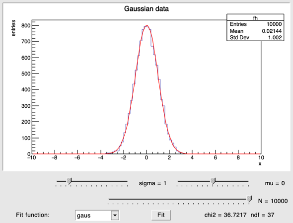

# Adding spline fitting to the fit GUI — a vibe coding session

This page documents how the multipoint spline smoothing feature was added to
[`examples/fit_gui.rut`](../examples/fit_gui.rut) in a live conversation
with Claude via the rooture MCP server.

---

<table>
<tr>
<th width="55%">Prompt / action</th>
<th>Result</th>
</tr>

<tr>
<td>

**Human:** "I would like to allow the fitting GUI to fit a multipoint spline
where the user can select the number of control points.
Is that doable? How would you do it?"

Claude proposes two approaches:

1. **True spline fit** — declare a parameterised `TF1` via
   `gInterpreter->ProcessLine`, with N y-values as parameters.
   ROOT's minimiser fits them to the histogram.

2. **Spline smoothing** — sample the histogram at N evenly-spaced
   x positions, build a `TGraph`, draw a `TSpline3` through it.
   Pure native rooture, no Cling string generation.

</td>
<td>

The human prefers the true spline.
Claude then asks whether to use `ProcessLine`.

</td>
</tr>

<tr>
<td>

**Human:** "Why do you need to fall back to ProcessLine?
Can't you do it directly in rooture?
In general, using ProcessLine should be a last resort."

Claude realises the spline-smoothing approach — `new TGraph`,
`dotimes` loop with `.SetPoint`, `new TSpline3 "spline" gr` —
is entirely expressible in native rooture and requires no Cling
string generation at all.

</td>
<td>

Key insight: rooture's callable bridge wraps lambdas as
`double f(double _a0, ...)` (flat args), so a parameterised
`TF1` with `double f(double*, double*)` genuinely can't be
created without ProcessLine. But a `TSpline3` drawn through
sampled histogram values *can* — and is arguably a more natural
description of "spline with N control points".

</td>
</tr>

<tr>
<td>

Claude adds:

- `"spline"` entry (id 4) to the combo box
- A `npts-row` with a "Control pts" slider (range 3–20),
  hidden at startup via `(.HideFrame win npts-row)`
- A combo-change callback that shows/hides the row with
  `(.ShowFrame win npts-row)` / `(.HideFrame win npts-row)`
  and re-layouts the window with `(.Layout win)`

```scheme
(def {on-combo-change} (\{} {do
  (if (== (.GetSelected combo) 4)
    {do (.ShowFrame win npts-row) (.Layout win)}
    {do (.HideFrame win npts-row) (.Layout win)})}))

(connect combo "Selected(Int_t)" on-combo-change)
```

</td>
<td>

<!-- replace with screenshot showing the spline row appearing -->


</td>
</tr>

<tr>
<td>

Claude implements `do-spline` — the core of the feature.
Sample the histogram at N evenly-spaced x values using
a `dotimes` loop, build a `TGraph`, construct a `TSpline3`,
and draw it on top of the histogram.

```scheme
(def {do-spline} (\{} {do
  (= {n}    (.GetPosition npts-sl))
  (= {xmin} -10.)
  (= {xmax}   10.)
  (= {gr} (new TGraph n))
  (dotimes i n {do
    (= {x} (+ xmin (/ (* i (- xmax xmin)) (- n 1))))
    (.SetPoint gr i x (.GetBinContent h (.FindBin h x)))})
  (= {sp} (new TSpline3 "spline" gr))
  (.SetText res-lbl
    (new TGString (concat "Spline (" (str n) " pts)")))
  (.cd canvas)
  (.Draw h "HIST")
  (.Draw sp "")
  (.Modified canvas)}))
```

No `ProcessLine`. No Cling string building.
Every operation goes through rooture's native method-call bridge.

</td>
<td>

<!-- replace with screenshot of histogram with spline overlay -->


</td>
</tr>

</table>

<tr>
<td>

Claude runs the example via MCP to verify it works end-to-end.

```scheme
(load examples/fit_gui.rut)
(.SetPosition npts-sl 15)
(do-spline)
```

**Bug 1:** `do-spline` resolves to a string — the definition was silently
dropped because `(dotimes i n ...)` caused a parse error that swallowed
the rest of the block.  `dotimes` expects a Q-expression for the binding,
just like `def`:

```scheme
; wrong — i is evaluated, auto-interned as "i" (a String)
(dotimes i n {body})

; correct
(dotimes {i} n {body})
```

**Bug 2:** `(.Draw sp "")` draws the spline with its own Y-axis frame,
which has a different scale from the histogram.  Fixed by using `"same"`
(lowercase — TSpline checks `b[0] == 's'`):

```scheme
(.Draw sp "same")
```

</td>
<td>

After both fixes, 15 control points give a smooth curve that follows the
histogram closely.  5 points span too coarsely for a σ = 1 Gaussian on
[-10, 10]; 10–15 points work well.

<!-- replace with screenshot of 15-pt spline result -->


</td>
</tr>

</table>

---

## Debugging session — the "spline missing from combo" rabbit hole

After the initial implementation, loading the file and inspecting the GUI showed
only four entries in the combo box — `gaus`, `pol1`, `pol2`, `pol3` — with the
`smooth` entry (id 4) absent.

<table>
<tr>
<th width="55%">Observation / hypothesis</th>
<th>What actually happened</th>
</tr>

<tr>
<td>

**Symptom:** `(.GetNumberOfEntries combo)` returns 4 after
`(load examples/fit_gui.rut)`.  The same `doto` block evaluated
interactively returns 5.

Claude investigates rooture's C++ source: `lval_read`, the MPC
grammar, `cling_new_auto_typed`, the `probe()` lambda, `builtin_doto`
error propagation.  No bug found in any of these paths.

</td>
<td>

The interactive path works fine.  The file-load path also works fine.
The problem is not in rooture at all.

</td>
</tr>

<tr>
<td>

**Breakthrough:** Claude writes a minimal repro file and loads it with
an absolute path:

```scheme
(load "/Users/ktf/src/rooture/examples/combo_test.rut")
; => "entries:" 5
```

Then tries the relative path that the session has been using all along:

```scheme
(load examples/fit_gui.rut)
(.GetNumberOfEntries combo)  ; => 4
```

Inspects the installed copy at
`…/share/rooture/examples/fit_gui.rut`.

</td>
<td>

The installed file is the **old pre-spline version** — it only has four
`AddEntry` calls.  `(load examples/fit_gui.rut)` was resolving against
the install prefix, not the source tree, because `rooture-env.sh`
starts the process with the build directory as its working directory.

Every edit to the source file was invisible to the running MCP server.

</td>
</tr>

<tr>
<td>

**Fix 1 — stale install:** `rooture-env.sh` now `cd`s to the source
directory after sourcing the build environment, so relative `load`
paths resolve against the source tree without requiring `cmake
--install` after every edit:

```bash
SOURCE_DIR="$(cd "$(dirname "$0")" && pwd)"
cd "$SOURCE_DIR" || exit 1
exec rooture "$@"
```

</td>
<td>

After restarting the MCP server, `(load examples/fit_gui.rut)` loads
the source file.  Five entries, spline present.

</td>
</tr>

</table>

---

## Debugging session — combo always fits with gaus

With the combo fixed, the Fit button still always ran a Gaussian fit
regardless of which entry was selected.

<table>
<tr>
<th width="55%">Observation / hypothesis</th>
<th>What actually happened</th>
</tr>

<tr>
<td>

The code used a shared mutable global to pass the selection from the
combo-change signal to the fit callback:

```scheme
(def {combo-sel} 0)

(def {on-combo-change} (\{id} {do
  (def {combo-sel} id)   ; update global
  ...}))

(def {do-fit} (\{} {do
  (= {sel} combo-sel)    ; read global
  ...}))
```

The idea: `GetSelected` can return stale values during signal dispatch,
so cache the id in a global when the signal fires and read it later.

</td>
<td>

`lenv_copy` — called when a lambda is created — **snapshots all
current global bindings by value** into the lambda's captured
environment.  `do-fit` was created after `combo-sel` existed, so its
captured env already contained `combo-sel = 0`.

`lenv_get` searches the captured env first, finds `0` there, and never
reaches the global where `on-combo-change` had written the new value.
The shared-mutable-global pattern simply does not work between
independently defined closures in rooture.

</td>
</tr>

<tr>
<td>

**Fix 2 — read selection at call time:**

```scheme
(def {do-fit} (\{} {do
  (= {sel} (.GetSelected combo))
  ...}))
```

`do-fit` is invoked by the Fit button click, not inside a signal
handler, so `GetSelected` returns the current value without any
staleness concern.  The `combo-sel` global and the update line in
`on-combo-change` were removed.

</td>
<td>

Verified: selecting `pol2` (id 2) and clicking Fit uses `pol2`.
`(.GetName (.GetFunction h "pol2"))` returns `"pol2"`.

</td>
</tr>

</table>

---

## Improving the smooth mode — adding chi²/ndf display

After the bug fixes, the smooth mode showed "Spline (N pts)" in the result label
while the fit modes showed chi²/ndf.  The user asked: "why not chi²/ndf for the
smooth case?"

<table>
<tr>
<th width="55%">Attempt</th>
<th>Result</th>
</tr>

<tr>
<td>

**Attempt 1 — rooture `dotimes` loop.**

Compute χ² = Σ(data − spline)² / data over all histogram bins in
a rooture loop:

```scheme
(= {chi2} 0.)
(= {nused} 0)
(dotimes {ib} (.GetNbinsX h) {do
  (= {data} (.GetBinContent h (+ ib 1)))
  (if (> data 0.)
    {do
      (= {xc} (.GetBinCenter h (+ ib 1)))
      (= {sv} (.Eval sp xc))
      (= {chi2} (+ chi2 (/ (* (- data sv) (- data sv)) data)))
      (= {nused} (+ nused 1))}
    {})})
```

</td>
<td>

Hangs.  100 iterations × up to 5 Cling method calls each ≈ 500
round-trips through rooture's Cling dispatch (type probe, alias
declaration, Execute).  Too slow to complete interactively.

</td>
</tr>

<tr>
<td>

**Attempt 2 — single `process-line` block with injected pointers.**

`(str obj)` for a TOBJ returns its raw pointer as a hex string.
Build one C++ compound statement that injects the `h`, `sp`, and
`res-lbl` pointers, runs the loop in C++, and writes the formatted
result directly to the label — all in one Cling call:

```scheme
(process-line (concat
  "{ TH1F* __h=(TH1F*)" (str h) ";"
  " TSpline3* __sp=(TSpline3*)" (str sp) ";"
  " double __chi2=0; int __ndf=0;"
  " for(int b=1;b<=__h->GetNbinsX();b++){"
  "   double d=__h->GetBinContent(b); if(d<=0) continue;"
  "   double x=__h->GetBinCenter(b);"
  "   double s=__sp->Eval(x);"
  "   __chi2+=(d-s)*(d-s)/d; __ndf++;}"
  " __ndf-=" (str n) ";"
  " ((TGLabel*)" (str res-lbl)
  ")->SetText(new TGString(Form("
  "\"chi2 = %.1f  ndf = %d\",__chi2,__ndf))); }"))
```

ndf = occupied bins − n control points.

</td>
<td>

Returns instantly.  With 5 control points:
`chi2 = 3093.1  ndf = 28` — poor fit as expected (points spread
across the empty tails).  With 15 points:
`chi2 = 62.6  ndf = 24` — spline closely follows the peak.

The pattern generalises: whenever a rooture loop over many bins
would make hundreds of Cling calls, replace it with a single
`process-line` block and inject object pointers via `(str obj)`.

</td>
</tr>

</table>

---

## Key takeaways

- **Native rooture first.** Before reaching for `ProcessLine`, ask whether
  the same result can be achieved with `new`, method calls, `dotimes`, and
  lambdas. Here, a `TSpline3` drawn through sampled histogram points gave
  the desired "N control points" behaviour entirely in rooture.

- **Show/hide rows with `HideFrame`/`ShowFrame`.** The control-points row
  is added to the layout at construction time but hidden at startup.
  Switching the combo reveals or hides it and calls `(.Layout win)` to
  re-flow the window — no rebuild needed.

- **`TSpline3` requires at least 3 points.** The slider minimum is 3 for
  this reason; 2 would crash inside ROOT's cubic-spline construction.

- **`dotimes` is the rooture for-loop.** `(dotimes {i} n {body})` binds `i`
  to 0 … n−1 and evaluates `body` each time. The binding variable must be
  a Q-expression `{i}`, not a bare symbol — same rule as `def`. Combined
  with `.SetPoint` it populates the `TGraph` without any C++ array manipulation.

- **TSpline3 draw option must be `"same"` (lowercase).** TSpline checks
  `option[0] == 's'` to suppress its own axis frame. Uppercase `"SAME"` fails
  this check and the spline redraws the Y axis with its own scale, making the
  curve appear squashed at the bottom of the pad.

- **`(load examples/foo.rut)` resolves against the process working directory.**
  The MCP server runs the installed rooture binary; without the `cd` fix in
  `rooture-env.sh`, relative loads silently hit the stale install prefix.
  Edits to source files are invisible until either `cmake --install` or the
  working-directory fix is in place.

- **For bin-by-bin loops, use `process-line` with injected pointers.**
  A rooture `dotimes` over 100 histogram bins makes ~500 Cling round-trips and
  hangs.  Instead, build a single C++ compound statement with `concat` and
  inject raw object addresses via `(str obj)` (which formats a TOBJ as its hex
  pointer).  The C++ loop runs natively and the result is written directly to
  the target widget — zero additional Cling overhead.

- **Closures snapshot globals by value.** `lenv_copy` copies all bindings
  present in the global env at lambda-definition time into the closure's own
  env.  A later `(def {x} newval)` at the root does not update copies already
  held inside other closures.  For values that must be read fresh at call time,
  call the ROOT method directly (`(.GetSelected combo)`) rather than trying to
  share mutable state between closures.
